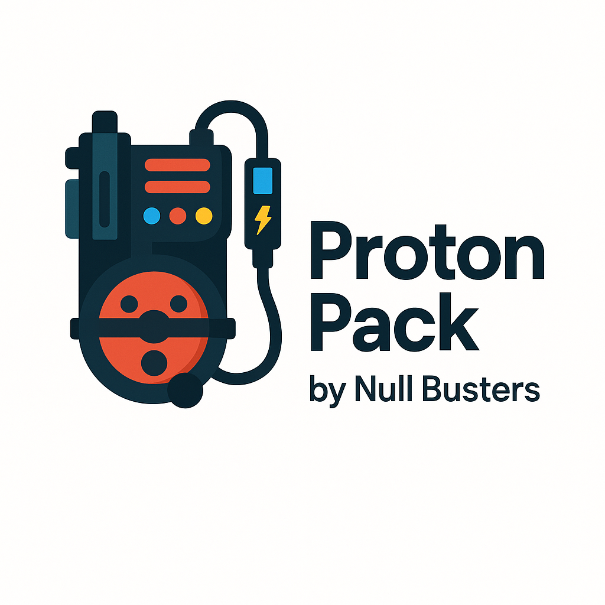

# Proton Pack - A Database Migration Safety Analyzer 
Proton Pack let's you analyze your database migrations and find potential issues
before they are deployed to production. This will help you to avoid data loss.

## Setup
You can install Proton Pack using pip, assuming you have this repository checked out:

`pip install -e .`

Once installed, you can run the CLI tool using `proton-pack`.

## Quickstart

### Parse SQL to AST
Using Proton Pack, you can parse SQL to AST, like:

`proton-pack parse 'SELCT * FROM users'`